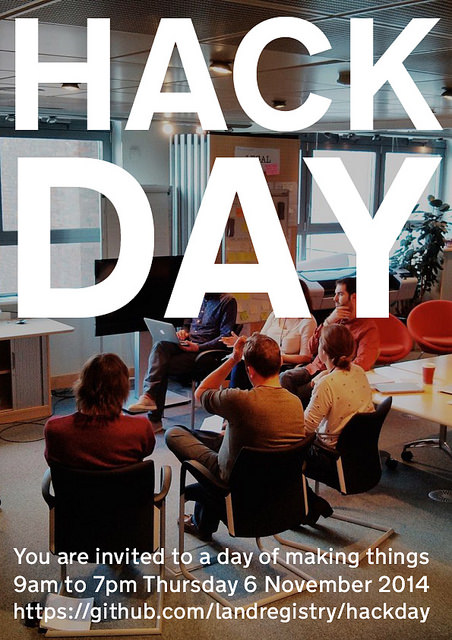

# Hackday

This repository contains public notes and links to open data sets for the internal Land Registry Hackday to be held in Plymouth on Thursday 6 November 2014.

Attendance is open to all Land Registry staff and people from other organisations working on the Land Registry Digital Service, but is otherwise by invitation only.

# What is a hackday?

It's an opportunity to explore new ideas by working with others in self-organised teams to build a demo to present at the end of the day.

There are many ways you can contribute, by bringing a problem, forming a team, writing content, developing design, helping to present as well as wranging data and writing code. So you don't need to be a developer to participate — anyone can come along for all or part of the day, join a team and help make the day a success!

Ideas should meet the needs of a user, and you are encouraged to conduct some informal [user research](https://www.gov.uk/service-manual/user-centred-design/user-research) with people inside and outside of your organisation to find problems people are experiencing with Land Registry data or services ahead of the day and come with some ideas to work on with others on the day.

Great ideas may be developed further either as a part of the Digital Service or under the Land Registry Innovation Challenge.

* https://gds.blog.gov.uk/2014/08/05/this-is-what-transformation-looks-like/
* https://designnotes.blog.gov.uk/2014/08/04/why-governments-need-hack-days/ 
* http://en.wikipedia.org/wiki/Hackathon

## Schedule

Time | Activity
-----|---------
9:00 | Introductions
12:00 | Lunch (self-organised)
17:00 | Tea (provided)
18:00 | Presentations
18:45 | Wrap-up
19:00 | Future Inn bar

# Public resources

* https://www.gov.uk/government/organisations/land-registry
* https://www.gov.uk/land-registration/data
* https://www.gov.uk/browse/housing-local-services/owning-renting-property
* https://www.gov.uk/government/publications/land-registry-office-addresses/office-addresses
* https://www.geovation.org.uk/
* http://blog.whatfettle.com/2014/10/13/one-csv-thirty-stories/

*Please add more links if you are a member of https://github.com/LandRegistry or via a pull-request..*
